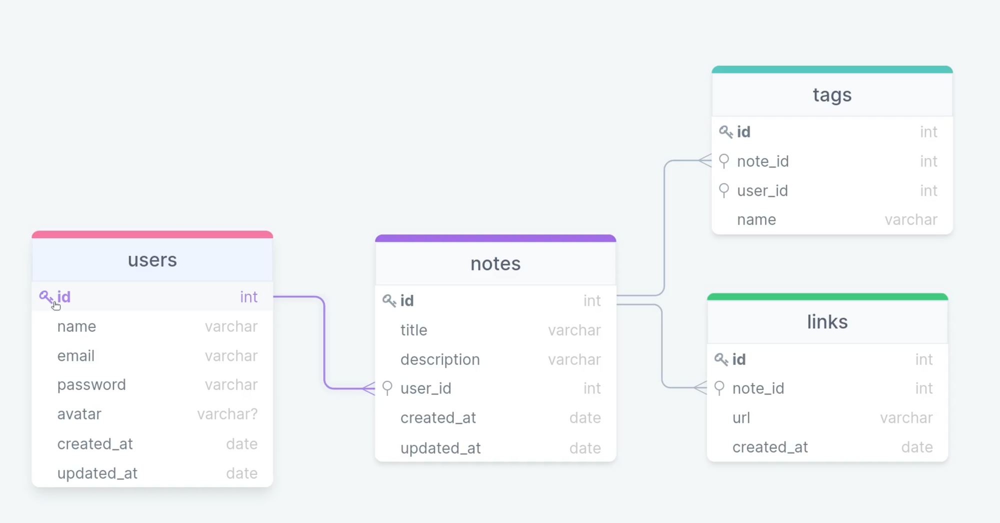

# rocket-notes

Construímos uma API completa utilizando Node.js e Express. Utilizamos o Insomnia para cadastrar as rotas e verificar seus status codes. Criamos um banco de dados utilizando SQLite, manipulamos o banco utilizando a ferramenta Beekeper Studio juntamente com o Query Builder Knex.js.

Estrutura do banco de dados:

