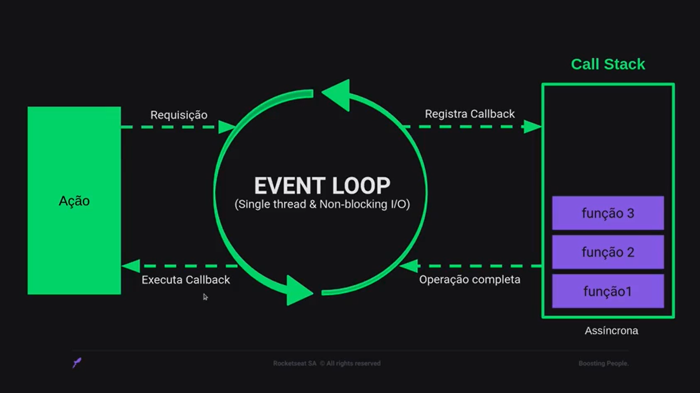
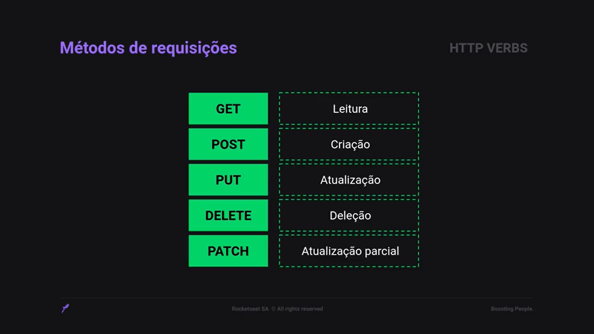
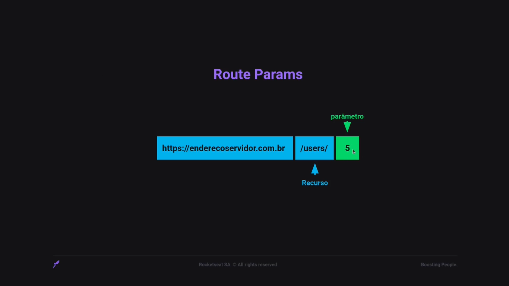
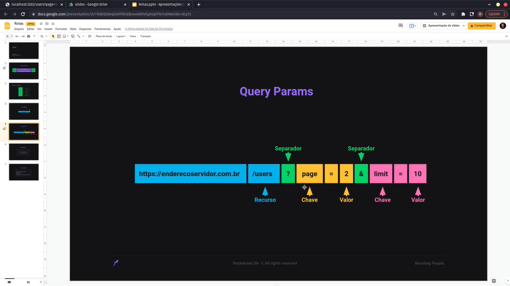
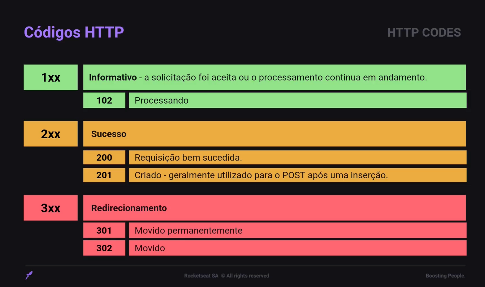
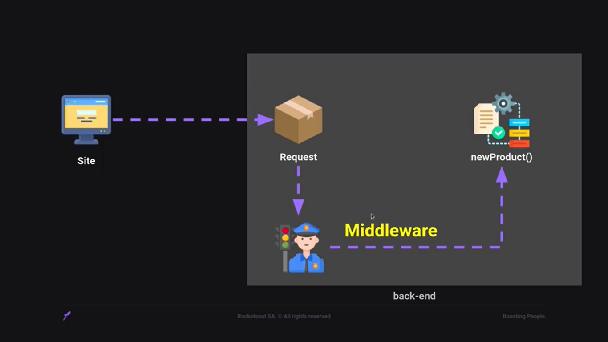

# Funcionamento do Node.js

Imagine um site com uma tela de login. Quando o usuário digitar o e-mail e a senha e clicar no botão de entrar (ação), ele envia para a API feita em Node uma requisição, dentro dela vamos ter o e-mail, a senha e a informação de que deseja se autenticar na API para obter as informações do usuário.
Essa requisição vai executar 3 funções, por exemplo. A primeira função para verificar se o usuário existe, a segunda função para verificar se a senha do usuário está correta, e a terceira função para, se o usuário existe e a senha está correta, devolver os dados do usuário.
Quando a requisição chega, a primeira coisa que o Node tem é o Event Loop, que funciona como um porteiro ou catraca controlando quem chega e quem sai. O Event Loop tem a característica de ser single thread, ou seja, como se fosse uma pessoa responsável por essa função, e é non-blocking I/O (input/output), ou seja, pega a requisição e passa para a próxima etapa, que é registrar dentro de uma Call Stack, que é uma pilha de chamadas (coloca num registro de processamento e quando chegar a vez será processado).
Dentro da Call Stack, ficam as funções aguardando serem processadas. Essas funções são assíncronas, ou seja, uma função não fica esperando a outra terminar (podemos pedir que uma função espere a outra), conforme elas forem terminando vão saindo da pilha e avisam o Event Loop que a operação está completa, então o Event Loop devolve a resposta para quem solicitou a execução dessa função.

# Métodos HTTP

# Route Params
- Consegue passar um valor/informação como parâmetro para a rota;
- Enviar alguma informação para a rota e obter essa informação utilizando o request;
- São utilizados para dados simples, como id (ex.: receber o id do produto para exibir para o usuário);
- endereço da API + rota da API (recurso) + parâmetro.

# Query Params
- endereço do servidor + recurso + ? (informar que o que vem a seguir é um query param) + nome do query param + = (atribuir um valor para o query param) + & (passar mais de um query param);
- No Route Params os valores são obrigatórios, já no Query Params são opcionais.

# Organizando a estrutura do projeto

# Controllers

Controller é a camada responsável por processar as requisições da aplicação.
Usa classe porque permite dentro dela criar e acessar várias funções.
    
Um controller pode ter no máximo 5 métodos:
* index - GET para listar vários registros;
* show - GET para exibir um registro específico;
* create - POST para criar um registro;
* update - PUT para atualizar um registro;
* delete -  DELETE para remover um registro;

# HTTP Codes

# Entendendo Middlewares

Exemplo (sem middleware):
- Site contendo funcionalidade de cadastrar novos produtos
- Ao clicar no botão de cadastrar novo produto, o site envia para o backend uma requisição (pacote contendo as informações do produto que deve ser cadastrado)
- No backend, a requisição é enviada para uma função chamada newProduct(), responsável por pegar as informações e cadastrar na base de dados

Exemplo (com middleware):
- Só pode cadastrar um novo produto se o usuário for administrativo
- O middleware intercepta a requisição e verifica se o usuário que está tentando cadastrar um novo produto tem permissão
- Se sim, permite seguir para a função de cadastrar produto
- Se não, impede de seguir para a função de cadastrar produto

Middleware são funções que tem acesso ao objeto de solicitação (requisição), ao objeto de resposta (resposta) e à próxima função de middleware no ciclo solicitação-resposta do aplicativo.
A próxima função middleware é comumente denotada por uma variável chamada next.
Middlewares podem:
- Executar qualquer código;
- Fazer mudanças nos objetos de solicitação e resposta;
- Encerrar o ciclo de solicitação-resposta;
- Chamar o próximo middleware na pilha.