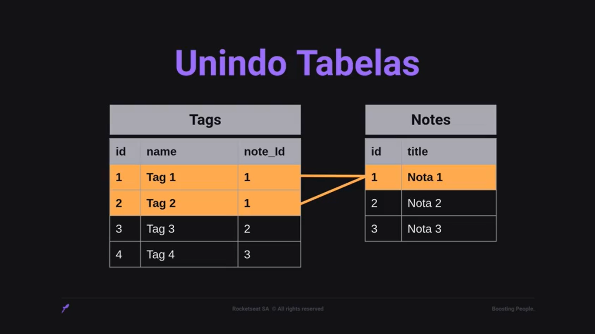

# SQL Query Builder

## Query Builder

Query Builder é um Construtor de Consulta.  
Permite construir instruções SQL independente do banco de dados utilizado.  
Os bancos de dados relacionais utilizam o mesmo padrão de linguagem de consulta, o SQL.  
Porém, ao escrever o código SQL para um banco específico, se no futuro precisar trocar de banco de dados, pode impactar no funcionamento da aplicação.  
O Query Builder gera o código SQL para o banco de dados utilizado.  
Além disso, faz o código ficar performático e gera as consultas bem estruturadas para o banco de dados utilizado.  
Também apresenta sintaxe reduzida.

## Migrations

É uma forma de versionar a base de dados.  
Migrations trabalha na manipulação da base de dados: criando, alterando ou removendo.

### Métodos de uma Migration

* UP: método responsável por criar ou alterar algo no banco de dados;
* DOWN: responsável pelo rollback, ou seja, desfazer as alterações realizadas pela migration.

## NPM vs NPX

### NPM

Node Package Manager é o gerenciador de pacotes padrão para Node.js.  
Os pacotes e módulos necessários no projeto Node são instalados usando npm.  
Também utilizamos o npm para executar scripts e bibliotecas instaladas. 

### NPX - Package Runner

O npx significa Node Package Execute e vem com o npm acima da versão 5.2.  
É um executor de pacotes npm que pode executar qualquer pacote do registro npm sem sequer instalar esse pacote.

Resumindo:
* NPM é uma ferramenta usada para instalar pacotes;
* NPX é uma ferramenta usada para executar pacotes.

## Primary key e Foreign key

Primary key:
* Identificador único dentro da tabela;
* Cada registro tem seu próprio identificador;
* Garantir que esse valor não se repita;
* Muito comum o id ser utilizado como chave primária;
* O campo candidato a chave primária deve ser único dentro da tabela.
    
Foreign key:
* Chave dentro de uma tabela gerada em outra tabela;
* A chave estrangeira tem o objetivo de conectar tabelas;
* Vincular um registro com uma outra informação.
    
Resumindo:
* A chave primária garante que o registro tenha um identificador único;
* A chave estrangeira aparece numa tabela para vincular com a tabela onde é gerada.

## Cardinalidade

* Frequência com que uma tabela se relaciona com a outra;
* Um usuário pode cadastrar várias notas, mas uma nota vai estar vinculada somente a um usuário;
* Uma nota pode ter várias tags e vários links, mas um link e uma tag vão estar vinculados somente a uma nota.

## Inner Join - Unindo tabelas

* Serve para unir tabelas;
* As tabelas não se unirão fisicamente;
* Permite buscar os dados em duas tabelas e exibir os resultados unificados numa única consulta;
* Verifica e retorna os registros em comum das tabelas.

* No código, para unir as tabelas, necessita de:
    * table - nome da tabela;
    * primary_key - chave primária que deseja conectar com a chave estrangeira;
    * foreign_key - coluna em comum que deseja conectar.

* Ex.:
    * notes
    * notes.id
    * tags.note_id
* Necessário colocar o nome da tabela pois, ao fazer consulta em mais de uma tabela, as tabelas podem ter colunas com nomes iguais.