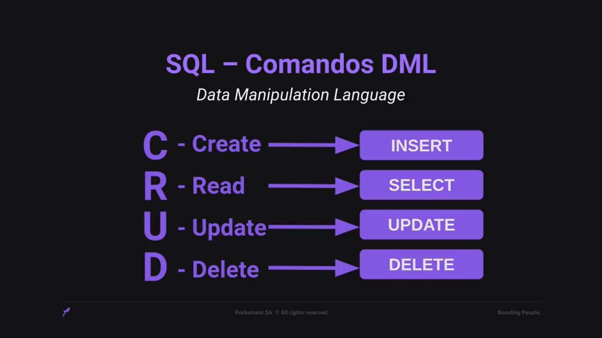

# Estrutura do Banco de Dados

# SQL

SQL - Structured Query Language, ou Linguagem de Consulta Estruturada.
É a linguagem padrão para banco de dados relacionais.

Comandos DDL (Data Definition Language):
* CREATE (criar uma tabela);
* DROP (deletar uma tabela);
* ALTER (atualizar informações da tabela).

Comandos DML (Data Manipulation Language):

